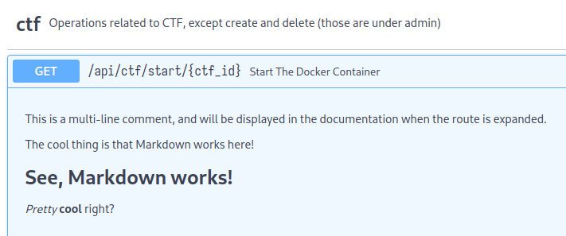

# pwncore

A CTF platform backend written in [FastAPI](https://github.com/fastapi/fastapi) using [Tortoise-ORM](https://github.com/tortoise/tortoise-orm), [Tox](https://github.com/tox-dev/tox) and [Pydantic](https://github.com/pydantic/pydantic)

## Table of Contents

1. [TODO](#todo)
2. [Prerequisites](#prerequisites)
3. [Installation](#installation)
4. [Usage](#usage)
5. [Project Structure](#project-structure)
6. [Documenting](#documenting)
7. [Contributing](#contributing)
8. [License](#license)

## TODO

- [ ] Remove `round2` logic and paths
- [ ] feat: Power ups
- [ ] fix: Leaderboard caching error
- [ ] Issue identification and Bug fixes
- [ ] Setup tests using `tox`
- [ ] feat: Leaderboard graph

## Prerequisites

Before you begin, ensure you have met the following requirements:

- Python 3.7+ (< Python 3.13)
- Docker (optional, for container functionality)

## Installation

1. Clone the repository (or a fork of the repository):

   ```bash
   git clone https://github.com/lugvitc/pwncore.git
   cd pwncore
   ```

2. Set up a virtual environment:

   ```bash
   python3.12 -m venv .venv
   source .venv/bin/activate
   ```

3. Install Poetry and project dependencies:

   ```bash
   pip install poetry
   poetry install
   ```

4. Configure the project:
   - Open `src/pwncore/config.py`
   - Set `db_url` to a path for persistent storage or continue with in-memory database
   - Configure `docker_url` as needed (see [Usage](#usage) for details)

## Usage

1. Start:

   ```bash
   uvicorn pwncore:app --reload

   # OR

   poetry run dev
   ```

2. Access the auto-generated documentation at [http://localhost:8080/docs](http://localhost:8080/docs)

3. Docker configuration:
   - Enable and start the Docker service on your system, or
   - Modify `src/pwncore/config.py:62`:

```python
	docker_url="http://google.com",  # For testing without Docker
```

## Project Structure

```
.
├── Dockerfile
├── LICENSE
├── OVERVIEW.md
├── poetry.lock
├── poetry.toml
├── pyproject.toml
├── README.md
├── src
│   └── pwncore
│       ├── config.py
│       ├── container.py
│       ├── docs.py
│       ├── __init__.py
│       ├── __main__.py
│       ├── models
│       │   ├── container.py
│       │   ├── ctf.py
│       │   ├── __init__.py
│       │   ├── pre_event.py
│       │   ├── round2.py
│       │   └── user.py
│       ├── py.typed
│       ├── routes
│       │   ├── admin.py
│       │   ├── auth.py
│       │   ├── ctf
│       │   │   ├── __init__.py
│       │   │   ├── pre_event.py
│       │   │   └── start.py
│       │   ├── __init__.py
│       │   ├── leaderboard.py
│       │   ├── round2.py
│       │   └── team.py
│       └── types.py
├── tests
│   ├── __init__.py
│   └── test_login.py
└── tox.ini

7 directories, 32 files
```

## Documenting:

FastAPI generates documentation for the routes using OpenAPI. The documentation is available by default at `/docs` (Swagger UI) and `/redoc` (ReDoc).

There are 2 ways to add documentation for a route:

1. Explicitly mention the summary and description:

```py
@router.get("/start/{ctf_id}",
    description="This description supports **Markdown**.",
    summary="Start the docker container"
)
```

2. Let it infer summary from function name and description from comments:

```py
@router.get("/start/{ctf_id}")
async def start_the_docker_container(ctf_id: int):       # The function name is inferred for the summary
    # This is a regular single-line comment.
    # Will not be displayed in the documentation.
    '''
    This is a multi-line comment, and will be displayed
    in the documentation when the route is expanded.

    The cool thing is that Markdown works here!
    # See, Markdown works!
    _Pretty_ **cool** right?
    '''
    return {"status": "CTF started"}
```

Result:



## Contributing

Follow the following steps while working on the platform

1. Fork the repository
2. Create your feature branch (`git checkout -b feature/functionality`)
3. Commit your changes (`git commit -m 'Add some functionality'`). Go through [CONTRIBUTING](/CONTRIBUTING.md) for preferred commit messages
4. Push to the branch (`git push origin feature/functionality`)
5. Open a Pull Request

## License

This project is licensed under the [GNU GENERAL PUBLIC LICENSE] - see the [LICENSE](./LICENSE) file for details.
